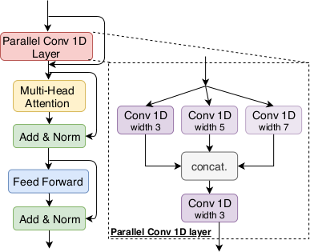
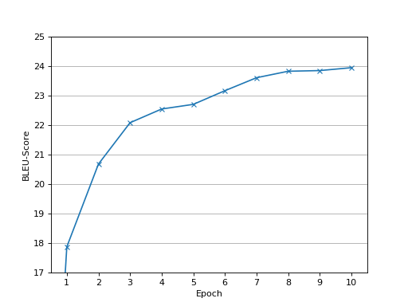

# Character-Level Translation with Self-attention

A PyTorch implementation of the convtransformer model as described by Gao et al.
in
["Character-Level Translation with Self-attention"](https://www.aclweb.org/anthology/2020.acl-main.145.pdf),
2020.


## Introduction

The convtransformer is a neural machine translation model proposed by Gao et al.
(["Character-Level Translation with Self-attention"](https://www.aclweb.org/anthology/2020.acl-main.145.pdf),
2020). While the majority of neural machine translation systems nowadays
operates on the subword-level, the convtransformer is a character-level model,
working directly with raw characters instead of subword-segments.

It is based on the transformer (Vaswani et al.,
["Attention Is All You Need"](https://proceedings.neurips.cc/paper/2017/file/3f5ee243547dee91fbd053c1c4a845aa-Paper.pdf),
2017), but with a modified architecture: each encoder block contains an
additional sublayer, which is composed of several 1-dimensional convolutions
with different window sizes. The aim of these convolutional sublayers is to
facilitate interactions among nearby characters, which ultimately leads to
better performance and shorter training times.
<p align="center">  </p>

A fascinating aspect about character-level models like the convtransformer is
that they require only a minimal amount of pre- and postprocessing, since the
model learns concepts such as word separation all by itself. However, they also
have a quite significant downside: the long training times, which are often
several times longer compared with their subword-level counterparts.
Unfortunately, the convtransformer is no exception in this regard.

This repository contains my own implementation of the convtransformer model in
PyTorch. I trained it on the
[French-German Europarl parallel corpus](http://opus.nlpl.eu/Europarl-v3.php)
to create a neural machine translation system from French to German.

The original implementation by the authors, using
[fairseq](https://github.com/pytorch/fairseq)
as a base, can be found
[here](https://github.com/CharizardAcademy/convtransformer).


## Usage

The repository contains 9 files in total.
The main scripts are:
* `preprocess.py`: Downloads and preprocesses the parallel corpus.
* `train.py`: Trains the convtransformer model.
* `translates.py`: Translates a sentences using the trained model.
* `evaluate.py`: Evaluates the trained model on a test set.

The remaining files are auxiliary modules:
* `convtransformer.py`: Implementation of the convtransformer as PyTorch module.
* `scheduler.py`: Scheduler for the inverse square root decay scheme.
* `dataset.py`: Custum dataset class to organize the batches.
* `alphabet.py`: Lookup table between characters and their associated indices.
* `config.py`: Class containing the default parameters.

The last module `config.py` contains the default values for all the
preprocessing, training and model parameters. They can be modified by changing
the corresponding values in the file.


### Preprocessing

Before the training, the data sets need to be built first:

```
python preprocess.py
```

The script downloads the
[French-German Europarl parallel corpus](http://opus.nlpl.eu/Europarl-v3.php),
does some basic cleaning and filtering, and constructs separate training,
validation and test sets. All in all, seven files are created, which are saved
in the folder `data`:
* `train.src`, `train.tgt`: The source and target files of the training set.
* `validation.src`, `validation.tgt`: The source and target files of the
                                      validation set.
* `test.src`, `test.tgt`: The source and target files of the test set (these can
                          be used afterwards to evaluate the trained model).
* `alphabet`: The character vocabulary.

The script filters out characters which occur only rarely and replaces them with
a special 'unk'-character. The remaining characters form the vocabulary of the
model and are saved in the last-mentioned file `alphabet`.

Naturally, the model can also be trained on a different parallel corpus, as long
as equivalents of these files are provided.


### Training

Now the model can be trained with the following command:

```
python train.py
```

In the default configuration, the model is trained for 10 epochs, while
checkpoints are saved in the folder `save` in regular intervals and after each
epoch. In order to not slow down training too much, the model is restricted in
the default setting to a maximum sentence length of 300 characters.

The training regime follows rather closely the configuration described in the
original transformer paper by Vaswani et al.,
["Attention Is All You Need"](https://proceedings.neurips.cc/paper/2017/file/3f5ee243547dee91fbd053c1c4a845aa-Paper.pdf).
However, all model and training parameters can be modified by changing the
corresponding parameter values in `config.py`. The default configuration assumes
a GPU with 8 GB RAM. In case there is less RAM available, the batch size
`sz_batch` needs to be adjusted in order to avoid out-of-memory errors.


### Inference

After the training is finished, the model can be used to translate sentences
from French to German:

```
python translate.py trained-model.pt "Je parle allemand."
```

The script expects the path to the trained model as first argument, and the
sentence to be translated as second argument. It uses a beam search algorithm
with default beam width of 3, but a different width can be specified via the
`--beam-width` flag.


### Evaluation

To evaluate the trained model, run:

```
python evaluate.py trained-model.pt test.src test.tgt
```

Here, `trained-model.pt` is a path to the trained model, and `test.src` and
`test.tgt` are the source and target files of the test set. The script
calculates the BLEU-score using
[SacreBLEU](https://github.com/mjpost/sacreBLEU).
By default, the beam search uses a beam width of 3, but a different value can be
specified via the `--beam-width` flag.


## Performance

I trained the model on a single GPU for 10 epochs on the
[French-German Europarl parallel corpus](http://opus.nlpl.eu/Europarl-v3.php)
(about 1.6M sentence pairs). This took almost a week and I stopped at this
point, even though the model was still far from converging. Character-level
models are known for their long training times and the convtransformer is
obviously no exception. The following graph shows the progression of the
BLEU-score on the test set:
<p align="center">  </p>

Although translating French to German has not been too much in the focus of
machine translation research, the conference
[WMT19](http://www.statmt.org/wmt19/)
included a translation task for this pair and the model I trained achieves a
BLEU-score of 21.8 on the corresponding test set. This is not too bad for this
language pair and my modest hardware setup, but falls of course far short of
what bigger and properly trained models can achieve: the state of the art seems
to be a BLEU-score of 35.0, achieved by Xia et al.
([Microsoft Research Asia's Systems for WMT19](http://www.statmt.org/wmt19/pdf/53/WMT48.pdf),
2019), who used a big transformer ensemble, together with techniques such as
back translation and dual learning.


### Examples

Nevertheless, the trained model still produces quite usable translations.
Here are some selected examples of various French sentences (extracted from news
articles) and their German translations as produced by the model:

> **Input:** Malgré une conscience écologique croissante, la voiture demeure
> le mode de transport privilégié des Français pour effectuer leur trajet
> quotidien entre leur domicile et leur lieu de travail.

> **Output:** Trotz eines zunehmenden Umweltbewusstseins bleibt das Auto das
> privilegierte Verkehrsträger der Franzosen, um ihre tägliche Fahrt zwischen
>  ihrem Wohnsitz und ihrem Arbeitsplatz durchzuführen.

Since I trained the model on the Europarl corpus, it usually handles topics
concerning European politics rather well, although it has a tendency to drop
parts of the sentence (e.g. here *à l'aube* and *due au coronavirus*):

> **Input:** Au terme d’un sommet marathon, les dirigeants européens sont
> parvenus, mardi 21 juillet à l’aube, à un accord sur le plan de relance
> qui doit permettre de compenser les effets de la récession provoquée par la
> pandémie due au coronavirus.

> **Output:** Nach einem Marathongipfel haben die europäischen Staats- und
> Regierungschefs am Dienstag, dem 21. Juli, eine Einigung über das
> Konjunkturprogramm erzielt, damit die Auswirkungen der Rezession durch die
> Pandemie ausgeglichen werden können.

The model often has problems in choosing the appropriate translation for a word
in a given context (e.g. here *s'abattre* should rather be translated with
*niedergehen*):

> **Input:** Des chutes de neige très importantes continuent de s'abattre dans
> certaines régions, en premier lieu dans le nord-est du pays et dans les
> Alpes.

> **Output:** In einigen Regionen werden weiterhin sehr große Schneefälle
> geschlachtet, vor allem im Nordosten des Landes und in den Alpen.

On the other hand, it is pretty good in inventing German-sounding analogues of
words it does not know (e.g. here *pachydermes* is translated as *Paschydermen*,
the correct translation being *Dickhäuter*):

> **Input:** Des scientifiques ont commencé à utiliser l'imagerie satellite
> pour compter les éléphants depuis l'espace, une technique prometteuse pour
> contribuer à la protection des pachydermes en Afrique.

> **Output:** Wissenschaftler haben damit begonnen, das Satellitenbild zu
> verwenden, um Elefanten seit dem Weltraum zu rechnen, eine vielversprechende
> Technik, um zum Schutz der Paschydermen in Afrika beizutragen.

Of course, sometimes the model simply fails to provide a coherent translation:

> **Input:** Le site archéologique de Pompéi, la ville romaine ensevelie par
> une éruption volcanique il y a presque 2.000 ans, a dévoilé lundi de
> nouveaux trésors découverts au cours des dernières fouilles, parmi lesquels
> d'intrigantes amulettes.

> **Output:** Die archäologische Website in Pompéi, die römische Stadt vor
> fast 2 000 Jahren durch Vulkanausbruch, hat am Montag neue Schätze entdeckt,
> die während der letzten Gruppierung entdeckt wurden.
